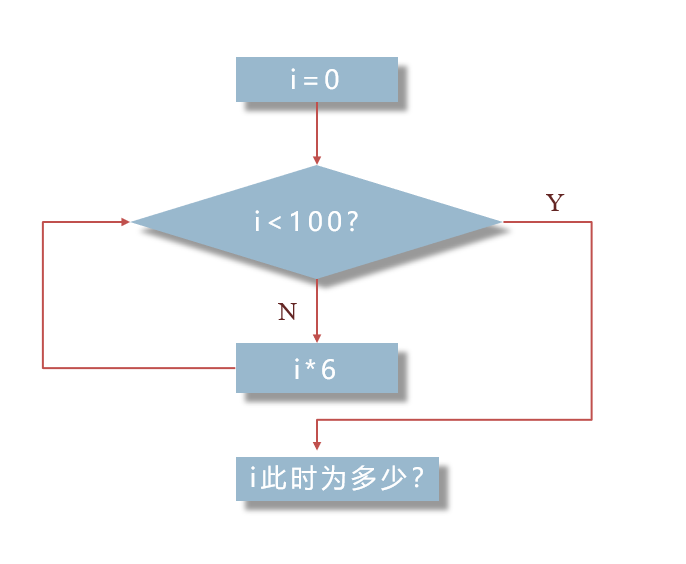
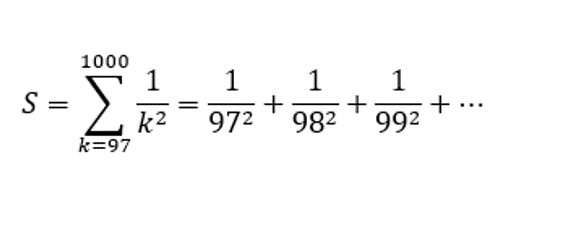
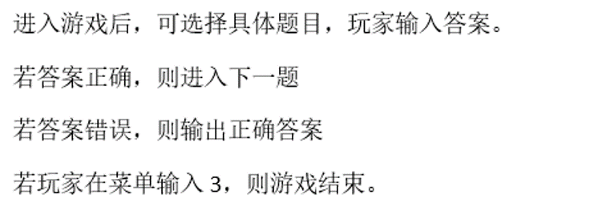
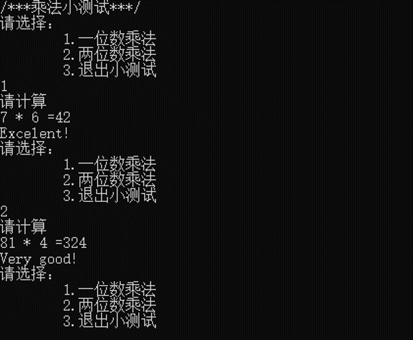
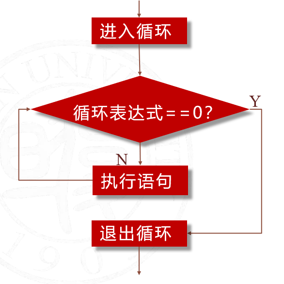
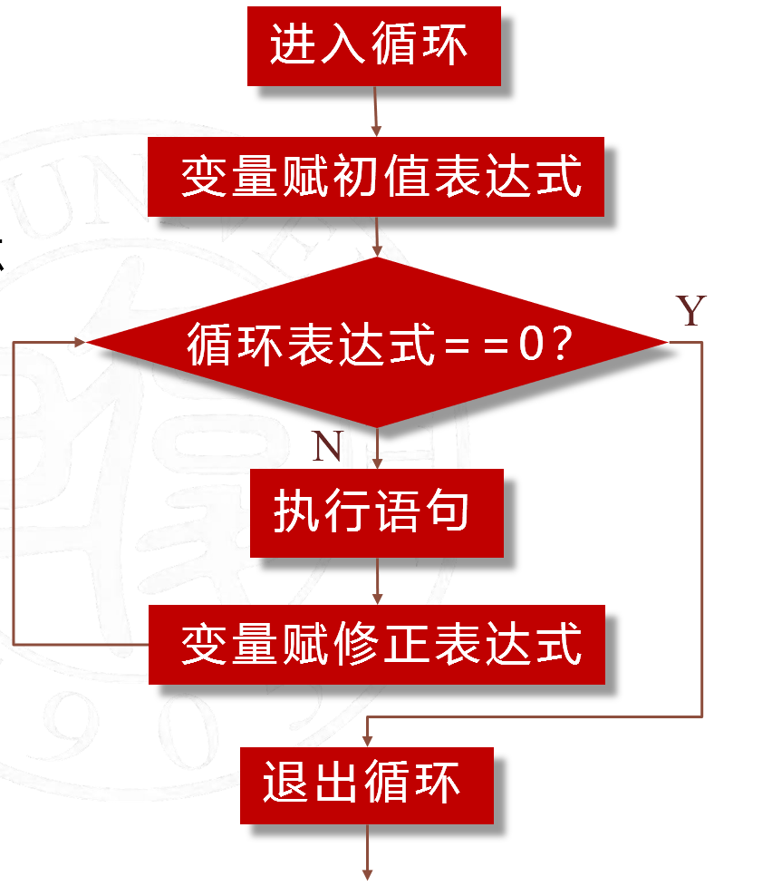
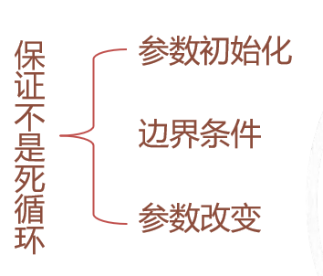
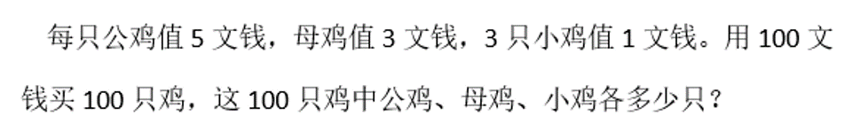
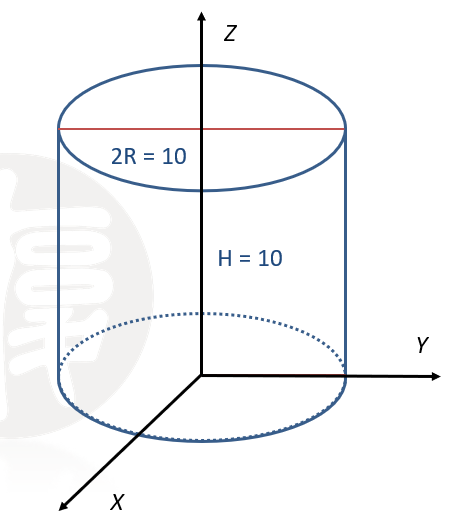

# 5 循环结构

负责人：jinkrui(<jinkrui@163.com>)

循环结构用于进行“重复”的工作，它通常被描述为在某个条件成立时，重复执行某个操作或计算。

当然，这绝不是什么陌生的东西。相信大家在高中数学的学习中一定做过这样的题目：



而它就是一种循环。经过之后的学习，你可以了解到上图的

> i * 6

> i < 100 ?

都可以替换成各种各样的、包括但不限于简单数学式子的表达式，来满足人们千奇百怪的需求！（~~以及我们的作业！~~）

---

本章内容可以分为两部分，

* 循环结构语句

>*即循环算法可以在什么地方使用、循环语句的语法。*

* 循环结构的嵌套

>*当然，只要熟悉了循环结构的算法，我们会发现循环的嵌套是很自然的一件事。*

本章内容请配合本页和课程视频食用~

[Day-5 循环结构]\(此处应有视频链接\)

## 5.1 循环语句

### 5.1.1 循环结构的事例

***本节课程将会通过引入若干例子来进行讲解相关概念。同学们不需要记住所有例子，只需要理解它们的含义。***

本页内容将对视频中难理解的部分进行补充讲解，方便同学们随时查阅

#### 例1.1.1 计算数列的和



这里要注意理解加和符号 **Sigma** $\sum^{1000}_{k=97}$

这里的 k 就是后面 $\frac{1}{k^2}$ 中的 k ，它可以代入不同的值。而这个加和符号的意思是把 k 分别代入从97到1000的每个自然数，再把所得的每一项都加起来。

很自然地，这个求和的过程中我们可以按顺序分别代入 97、98、99……直到1000，这样不断增加 1 的行为让我们联想到 C 语言中的自增语句 `k++;`

同时根据上面关于 Sigma 符号的讲解，我们需要把每一项加起来。如果用 S 来储存和的值，我们可以用 `S=S+1.0/(k*k);` 来使 C 程序实现这一过程，因为 k 有904个值需要分别代入，由此我们可知这条语句要被**重复**904次。

综上所述，如果我们设 S 现在是0，k 现在是97，那么要做的事有三件——

1. `S = S + 1.0/(k * k);`

2. `k = k + 1;`（或者可以写成 `k++;`）

3. 若 k 小于等于1000，回到第一步，否则结束。

---

*如果你愿意，当然也可以按照视频里的做法让 k 从1开始自增，不管怎样我们所加的项数都是904项。*

#### 例1.1.3 乘法小测验



下面我们还给出了它运行时的截图



如果程序仅运行一次，那么我们只需要上章节课所学的 if 判断语句就能实现，但这个例子要求我们实现**不断运行**直到玩家自行决定结束。

抓住主要矛盾，忽略次要矛盾，即暂不考虑如何实现出题和判断功能，仅考虑如何“**重复**”

根据题目描述“玩家在菜单中输入3，则游戏结束”我们发现要做的事有以下两件——

1. 显示菜单，若玩家输入3，则结束游戏，否则执行下一步。

2. 执行游戏内容，并返回第一步。

---

*这个程序还可以进一步考虑玩家输入了非“1”、“2”、“3”的其他字符时的处理。*

### 5.1.2 循环结构语句

***通过以上例子我们了解了循环地作用，接下来我们学习如何用C语言来实现上述想法。本节内容需要勤加记忆***

下面我们给出 while 语句和 for 语句的语法：

```
while(循环表达式)
{
	循环体 
}

for(变量赋初值表达式; 循环表达式; 变量修正表达式)
{
	循环体 
}
```

这两种语句各有特点，但同时它们可以完全互换。  
下面给出两种语句在计算机内的执行顺序，这需要我们**勤加记忆**！





这是完成例1.1.1的一种代码写法，供我们熟悉 for 语句的执行顺序。我们可以对照上图来亲自走一遍流程：

```
# include <stdio.h>

int main()
{
	double sum = 0.0;//因为涉及到不能整除的除法，所以声明为双精度变量
	//要记住声明的变量应进行初始化后再进行使用，即 sum 要初始化为0，否则有时编译器会为变量赋奇怪的值
	for(int i = 97; i <= 1000; i++)
	{
		sum = sum + 1.0/(i * i);
	}
	printf("%0.12f\n", sum);
	return 0;
}
```

---

接下来我们看循环结构语句的三部分



没错，这三部分仅仅是为了保证程序不会进入死循环，即永远无法结束的循环。当然，这里的“永远”是理论上的，实际上死循环的程序会被迫自行结束并返回一个错误的值（而不是`return 0;`）。

接下来我们来看看乘法小测验的一种实现方法

```
……
while(1)
	{
		if(menu != 3)
		{
			…………//实现测验过程的代码
		}
		else
			break;
}
return 0; }
```

我们已经知道，while 语句会判断括号里的表达式的真值，而之前我们学过，C 语言中“真”记为1，“假”记为0，且这里的1和0可以简单地理解为整形数据。  
现在括号里面的表达式为`1`且不会变化，也就是说括号里的表达式永远是真，即循环会一直继续下去。但这样岂不就是成立死循环了吗？

其实并不是，`break;`可以保证循环在特定条件下（elsa分支，即 `menu == 3`）结束循环。

**`break;`语句只能在循环中使用，执行它会使程序中止循环，从循环结束处继续执行程序。**

可以认为“menu是否等于3”才是这个循环的边界条件，它通过用户的不断输入来发生改变。

#### 例1.2.5 跳过输入的空白类字符

```
while((c = getchar()) == ' ' || c == '\t')
	;
```

循环的作用即不断从缓冲区输入字符，如果这个字符是空白类的就什么也不做，再输入下一个字符（即跳过），直到出现非空白类的字符。这里的“什么也不做”是通过空语句` ;`实现的。注意，while 语句的语法要求我们必须在循环内容里写至少一条语句，因此空语句不能省略

`||`即或运算符表示如果输入的字符时空格或者跳格键时表达式的值为真，进入循环。

`getchar()` 表示**每一次**进行循环都会要求输入一个字符赋值给字符型变量 c .

此外还有一些细节上的问题，如用括号控制表达式的运算顺序。由于赋值` = `的优先级低于或运算` || `，因此需要加一个括号先赋值，再进行或运算。否则 c 的值将出现问题。

还有一个问题是，如果全部的输入都是空白类字符，程序会进入死循环吗？

答案是不会的，如果输入的全部字符都是空白的，那么循环将会卡在`getchar()`处，要求用户输入新字符（比如'\n'），而不是进入了死循环

---

本小节最后我们来了解 for 语句和 while 语句的互换，而这种互换仅是形式上的不同——

```
变量赋初值表达式
while(循环表达式)
{
	循环体
	变量修正表达式 
}
```

```
for(变量赋初值表达式; 循环表达式; 变量修正表达式)
{
	循环体 
}
```

当然，我们也有

```
变量赋初值表达式
for( ;循环表达式; )
{
	循环体
	变量修正表达式 
}
```

甚至于

```
变量赋初值表达式
for( ; ; )//此处缺少循环表达式，相当于while(1)
{
	if(循环表达式)
		break;
	循环体
	变量修正表达式 
}
```

可见，for 语句是一种十分灵活的语句。表达式过长时，全部写在 for 语句的括号内也会显得程序臃肿难读。

### 5.2.1 循环结构的嵌套

***循环结构的嵌套也是一种常用的结构，在了解了循环的作用之后，产生它的嵌套可以说是很自然的。***

钟表的指针运动就可以看作是一种嵌套。经过一天需要时针跳动120次，而时针每跳动一次，需要分针跳动60次。即时针的跳动需要循环120次，而每循环一次，分针都要循环60次。

#### 例2.1.1 百鸡问题



这里我们主要来阐述最重要的循环边界的确定问题以及要注意的点。解决百鸡问题的一种代码写法部分如下

```
int cocks, hens, chicks;
	
	for(cocks = 0;cocks <= 20; cocks++)
	{
		for(hens = 0;hens <= 33; hens++)
		{
			chicks = (100 - 5*cocks - 3*hens)*3;
			if(chicks >= 0&&cocks + hens + chicks == 100)
				printf("公鸡%d只；母鸡%d只；小鸡%d只\n",cocks,hens,chicks);
		}
	}
```

而控制循环的 for 语句有这两句：

```
for(cocks = 0;cocks <= 20; cocks++)
```

```
for(hens = 0;hens <= 33; hens++)
```

这里的20和33分别是100文钱分别除以一只公鸡、一只母鸡的单价所得的整数结果。

很明显地，全买公鸡只能有20只鸡，全买母鸡只能有33只母鸡和3只小鸡共36只鸡，都不是我们要的答案，我们为什么还要去循环它们呢？

我们取20、33作为边界是在“100文钱最多能买多少只公鸡”、“100文钱最多能买多少只母鸡”这一层意义来说的。

也就是说，我们实际上考虑的是

* 把所有买鸡的方法都验证一遍，找出所有能买到100只鸡的答案。

这是一种穷举法，遵从穷举的要求：**不重不漏**，并且不漏更加重要。

此外，由于买鸡的方案不可能出现“负数鸡”，但是按照`chicks = (100 - 5*cocks - 3*hens)*3;`有可能出现负数鸡，因此我们在 if 条件句中加上了一个必要性条件`chicks >= 0`。

作为思考题，我们可以再考虑用公鸡和小鸡的数量来控制循环，写出一个程序来自动输出百鸡问题的解

---

* ** 算法1 穷举法**

> 穷举法的基本思想就是对范围内所有可能的解依次尝试

>> 若某个情况满足所有条件，则它是问题的一个解

>>若没有情况满足所有条件，则在这个范围内问题无解

虽然本质相同，但我们可以把常用的穷举法分为三类：

* 顺序列举

> 例如判断一个数$n$是否为质数可以从$2$开始对$n$取余，若余数不为0就加一，否则就`break;`提前中止循环，一直到$\sqrt n$

>再例如按照学号就可以遍历整个班级所有的学生 

* 排序列举

> 九局五胜的比赛以九局结束时有哪些情形；或者干脆不限结束时的局数，九局五胜的比赛有几种结束情形（准备嵌套！）

> 高中常见的各种排列组合题目

* 组合列举

> 百鸡问题

> 寻找给定区间$[a,b]$内方程组的解

---

### 拓展部份 重积分与循环的嵌套

** 本节内容在程序设计课程中不做任何考察！（~~想必数理基础的先导课程那边也不会做任何考察~~）**

计算形如

$$\displaystyle \iint {f(x,y)dxdy}$$

的二重积分式时，我们可以根据Fubini定理把它变化成

$$\displaystyle \int {dx\displaystyle \int {f(x,y)dy}}$$

再按照一元积分的方法依次计算。例如上式，计算$y$的积分时$x$可看作不变的。当然，先积分变量哪个都没问题。  
并且对于n重积分式，我们也能将其变为n个依次的一元积分式

** 计算$y$的积分时$x$可看作不变的，再按照一元积分的方法依次计算**引起了我们的注意。部分人在高中就略微接触过积分运算，知道** 积分运算就是一个分割成无穷小再求和的过程**  
虽然计算机无法做到“无穷小”，但它可以做到“足够小”，那么我们能不能运用循环结构来计算积分的近似值呢？

#### 例3.1.1 计算不均匀圆柱体的质量



其中，在点$(x,y,z)$处的密度为$\rho=10\sqrt {x^2+y^2}+20z+5$

要求圆柱体的质量，就是求定积分

$$\displaystyle \iiint_{D_{xyz}}{\rho dxdydz}$$

的值。

注意到$r=\sqrt{ x^2+y^2}$就是点到z轴的距离，于是这里利用圆柱坐标系直接给出计算的一种代码

```
# include <stdio.h>
# include <math.h>

#define PI 3.1415967

int main()
{
	double V = 0.0, deltaV = 0.0;//deltaV 用来储存第一重积分的值；V 储存第二重积分的值
	double R = 5.0, H = 10.0, rho;
	int r = 1, h = 1;//通过放缩0.01倍来控制循环
	
	while(H - 0.01*h >= 0)//偏大估计
	{
		while(R- 0.01*r >= 0)
		{
			rho = 5 + 20* 0.01* h + 10* 0.01* r;//计算此小块的近似平均密度
			deltaV = deltaV +\  
			 rho* 0.01* PI*\
			   ((0.01* r)* (0.01* r)-(0.01* (r-1))* (0.01* (r-1)));//计算此圆柱的一小块的质量
			r++;
		}
		V = V + deltaV;
		deltaV = 0.0;//重新初始化，因为处在外层（或者说是第二重积分）的 h 的值改变了
		r = 1;
		h++;
	}
	printf("偏大值估计为 %0.11f\t%d\n", V, h);
	
	h = r = 0; 
	V = 0.0, deltaV = 0.0;
	while(H - 0.01*h > 0)//偏小估计
	{
		while(R- 0.01*r > 0)
		{
			rho = 5 + 20* 0.01* h + 10* 0.01* r;
			deltaV = deltaV + \
			 rho* 0.01* PI*\ 
			  ((0.01* r)* (0.01* r)-(0.01* (r-1))* (0.01* (r-1)));
			r++;
			//printf("%0.11f\t%d\t%d\n", deltaV, r, h);
		}
		V = V + deltaV;
		deltaV = 0.0;
		r = 0;
		h++;
	}
	printf("偏小值估计为 %0.11f\t%d", V, h);
	return 0;
}
```

程序的输出如下

```
偏大值估计为 108764.67	1001
偏小值估计为 108121.11	1000
```

而利用Fubini定理计算这个重积分的值为 $108646.75$

上述代码把 H 和 R 分别分割为1000份和500份，总共$5\times10^5$个小块。增加分割的密度可以继续提高精度。

> 思考是什么造成了偏大估计和偏小估计的差别。提示：我们把某一点的密度当作了它周围一小块所有点的密度，误差就是由此产生的；注意联系两种估计参数的初始化和边界条件。

## FAQ

整理、列出常见问题和解决方案

### 2020/8/10 C 语言运算符的运算优先级是怎么回事？

在一个表达式中有多个运算符时，运算顺序就显得十分重要，否则会出现歧义。一个运算符的优先级越高，就越要先运算；越低越后运算。同级的运算符按照结合性（即从左到右或从右到左）运算。

简单来说有 ** 括号（包括`()`和`[]`） > 负号 >非运算符（`!`） > 计算运算符 （`/ * % + -`）> 关系运算符（`> >= < <= == !=`） > 与运算符（`&&`） > 或运算符（`||`） > 赋值运算符（`= *= /= += -=`）

下面给出一个参考表格

| 优先级 | 运算符 | 名称 | 结合性 |
| :---: | :---: | :---: | :---: |
| 1 | [] () . -> ++ -- | 后缀运算符 |  |
| 2 | - (类型) ++ -- * & ! ~ sizeof | 前缀运算符 | 从右到左 |
| 3 | / * % | 乘除运算符 |  |
| 4 | + - | 加减运算符 |  |
| 5 | << >> | 位移运算符 |  |
| 6 | > >= < <= | 关系运算符 |  |
| 7 | == != | 相等运算符 |  |
| 8 | & | 位运算符 |  |
| 9 | ^ | 位运算符 |  |
| 10 | \| | 位运算符 |  |
| 11 | && | 逻辑运算符 |  |
| 12 | \|\| | 逻辑运算符 |  |
| 13 | ?: | 条件运算符 | 从右到左 |
| 14 | = /= *= %= += -= <<= >>= &= ^= \|= | 赋值运算符 | 从右到左 |
| 15 | , | 逗号运算符 |  |

